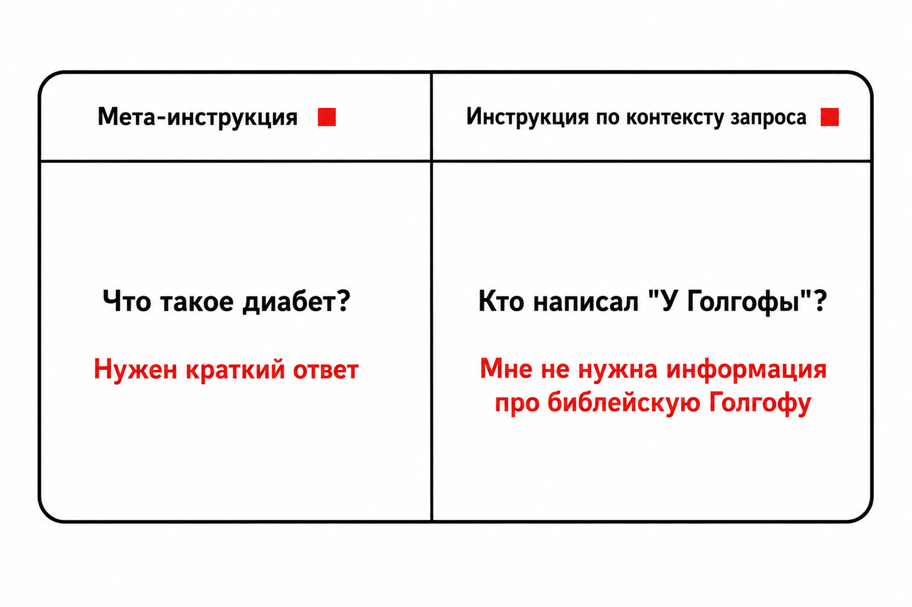

# InfoSearchRU

Модификация фреймворка [InfoSearch](https://github.com/EIT-NLP/InfoSearch) для работы с датасетами на русском языке.

## О проекте

InfoSearchRU — адаптация фреймворка [InfoSearch](https://github.com/EIT-NLP/InfoSearch) ([статья на arXiv](https://arxiv.org/abs/2410.23841)) для оценки способности поисковых моделей следовать инструкциям в задачах на русском языке. В отличие от оригинального бенчмарка, использующего данные на английском языке, данная версия включает русскоязычные датасеты по нескольким измерениям качества и расширенный набор скриптов оценки, в том числе для моделей серии Qwen3-Embedding.

Оценка проводится в трёх режимах:
- **Original** — базовый поиск без инструкций
- **Instructed** — поиск с учётом инструкции (документ должен удовлетворять условию)
- **Reversed** — поиск с инструкцией на отрицание (документ не должен удовлетворять условию)

Для измерения качества используются метрики из оригинального InfoSearch: **SICR**, **WISE**, **p-MRR**, MAP@1000, NDCG@10.

## Типы инструкций



*Сравнение примеров мета-инструкции (относится к общим характеристикам текста) и контекстной инструкции (относится непосредственно к содержанию запроса)*

## Датасеты

### Валидационные выборки с мета-инструкциями

Мета-инструкции задают требования к общим характеристикам документа (язык, аудитория, источник и т.д.), не зависящие от конкретного содержания запроса.

| Датасет | Условия |
|---------|---------|
| [Language-v1-ru](https://huggingface.co/datasets/tim-shu/Language-v1-ru) | `[Chinese]`, `[English]` |
| [Clarity-v1-ru](https://huggingface.co/datasets/tim-shu/Clarity-v1-ru) | `[keyword]` — точное вхождение ключевого слова в документ |
| [Source-v1-ru](https://huggingface.co/datasets/tim-shu/Source-v1-ru) | `[blog]`, `[forum post]`, `[news]` |
| [Audience-v1-ru](https://huggingface.co/datasets/tim-shu/Audience-v1-ru) | `[layman]`, `[expert]` |
| [Length-v1-ru](https://huggingface.co/datasets/tim-shu/Length-v1-ru) | `[sentence]`, `[paragraph]`, `[article]` |

### Валидационная выборка с контекстными инструкциями

Контекстные инструкции относятся непосредственно к содержанию конкретного запроса.

| Датасет | Описание |
|---------|---------|
| [instructed-retrieval-val](https://huggingface.co/datasets/tim-shu/instructed-retrieval-val) | Выборка запросов с контекстными инструкциями для оценки следования инструкциям |

## Оценка моделей Qwen3-Embedding

Добавлены скрипты оценки для двух моделей серии Qwen3-Embedding. Оба скрипта оценивают модели на всех шести задачах: `Clarity-v1-ru`, `Source-v1-ru`, `Audience-v1-ru`, `Language-v1-ru`, `Length-v1-ru`, `InstructedRetrieval-val-ru`.

### Qwen3-Embedding-0.6B

```bash
cd evaluation/
python models/qwen3_06b/evaluate_infosearch_tasks.py \
  --model_name_or_path Qwen/Qwen3-Embedding-0.6B \
  --output_dir qwen3-embedding-0.6b-results \
  --batch_size 32
```

### Qwen3-Embedding-4B

```bash
cd evaluation/
python models/qwen3_4b/evaluate_infosearch_tasks.py \
  --model_name_or_path Qwen/Qwen3-Embedding-4B \
  --output_dir qwen3-embedding-4b-results \
  --batch_size 8
```

Скрипты вычисляют метрики SICR, WISE, p-MRR, MAP@1000 и NDCG@10 в трёх режимах и выводят итоговую сводную таблицу.

## Установка

```bash
git clone https://github.com/TimothyShumilov/InfoSearchRU.git
cd InfoSearchRU/evaluation/
conda create -n infosearch python=3.9 -y
conda activate infosearch
pip install -r requirements.txt
```

Установите модифицированную версию библиотеки MTEB:

```bash
cd ../mteb_infosearch
pip install -e .
```

## Оригинальный проект

Данная работа основана на [InfoSearch](https://github.com/EIT-NLP/InfoSearch). Если вы используете код или данные, пожалуйста, процитируйте оригинальную статью:

```bibtex
@misc{zhou2024contentrelevanceevaluatinginstruction,
      title={Beyond Content Relevance: Evaluating Instruction Following in Retrieval Models},
      author={Jianqun Zhou and Yuanlei Zheng and Wei Chen and Qianqian Zheng and Zeyuan Shang and Wei Zhang and Rui Meng and Xiaoyu Shen},
      year={2024},
      eprint={2410.23841},
      archivePrefix={arXiv},
      primaryClass={cs.IR},
      url={https://arxiv.org/abs/2410.23841},
}
```
